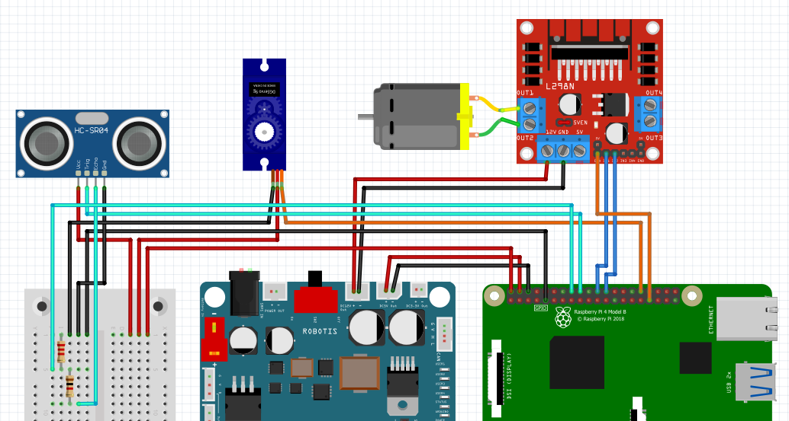

# Electrical Documentation

## Components Used
### TurtleBot Components
- OpenCR (32-bit ARM Cortex-M7)
- Raspberry Pi
- DYNAMIXEL Motor
- 11.1V LiPo Battery
- L298N Motor Driver
- SG90 Servo Motor
- RS360 DC Motor
- HC-SR04 Ultrasonic Sensor
- 720p USB Camera
- 360 degree LiDAR

## Connections
### SG90 Servo
- VCC → 5V rail from Raspberry Pi  
- GND → Common ground  
- Signal → PWM-capable GPIO pin on Raspberry Pi  

### L298N Motor Driver
#### Power
- VCC → 12V rail from OpenCR  
- GND → Common ground (OpenCR)
#### Control Signals
- ENA (Enable Pin) → PWM-capable GPIO pin on Raspberry Pi (for speed control)  
- IN1, IN2 → Digital GPIO pins on Raspberry Pi (for direction control)  
#### Motor Output
- OUT1, OUT2 → Connected to the two terminals of the RS360 DC motor  

### HC-SR04 Ultrasonic Sensor
- VCC → 5V rail from Raspberry Pi  
- GND → Common ground  
- TRIG → Digital GPIO pin on Raspberry Pi  
- ECHO → Connected to GPIO via voltage divider (5V → 3.3V)

### USB Camera
- Connected directly to the USB port of the Raspberry Pi

### Lidar
- Connected through USB2LDS to the USB port of the Raspberry Pi  

## Wiring Diagram

## Notes
- Ensure all components share a **common ground** (OpenCR, Raspberry Pi, and L298N)
- PWM is used to control motor speed and servo position
- A voltage divider is used on the ECHO pin to safely step down the signal from 5V to 3.3V
