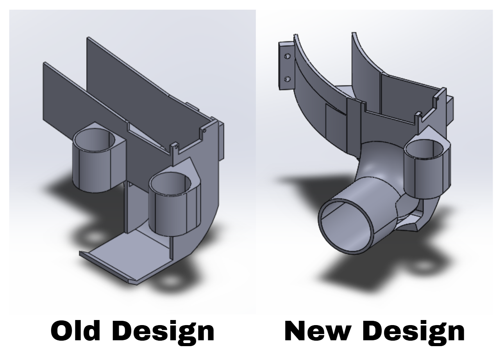

# Mechanical Subsystem

## Problem Description & Design Considerations

### Storage
The robot must:
- Store **nine ping pong balls securely**
- Prevent ball escape during motion (including ramps and uneven terrain)
- Ensure the **LiDAR sensor remains unobstructed**

To address this, balls are stored in an **inclined housing arranged around the TurtleBot**. This allows gravity to guide balls toward the feeding mechanism while avoiding vertical stacking that would block the LiDAR.

---

### Launcher
The system must:
- Launch ping pong balls **horizontally**
- Maintain consistent launch velocity and direction
- Fire at controlled intervals (e.g., 2s, 4s, 2s)

Unlike vertical launch systems, horizontal launching requires:
- More precise **alignment**
- Stable **ball feeding timing**
- Consistent **flywheel contact**

---

### Centre of Gravity (CG)
- A high CG increases the risk of tipping, especially on ramps
- Uneven weight distribution may destabilize the robot

Our design mitigates this by:
- Distributing balls **around the robot instead of stacking vertically**
- Using an **additional structural layer** while keeping heavy components low where possible

---

## System Overview

The mechanical system consists of:
- An **inclined circular storage housing** for 9 balls
- A **gravity-assisted feeder mechanism**
- A **rotating arm-based gating system** for controlled ball release
- A **single flywheel launcher** mounted beside the shooting tube
- A **raised LiDAR mount**
- A **multi-layer structural frame** to support all components

 

 

 

 

 

### Working Principle
1. Balls are stored in the inclined housing around the robot  
2. Gravity guides balls toward the feeder entrance  
3. A rotating arm mechanism allows balls to enter the shooting tube one at a time  
4. The ball enters the tube and contacts the single flywheel  
5. The flywheel accelerates the ball and launches it horizontally  

---

## Key Subsystems

### 1. Storage System
- Balls are arranged in an **inclined housing surrounding the TurtleBot**
- Gravity ensures passive movement toward the feeder
- Prevents LiDAR obstruction

**Advantages:**
- Even weight distribution improves stability  
- No vertical blockage of sensors  
- Efficient use of space around the robot  

---

### 2. Ball Feeder Mechanism

The feeder mechanism controls how balls enter the shooting tube.

#### Design
- Uses a **rotating arm driven by a servo motor**
- The arm has **protrusions positioned at 90° intervals**

#### Working Mechanism
- One protrusion blocks the next ball in line  
- Another protrusion allows exactly one ball to drop into the tube  
- As the arm rotates:
  - The previously blocked ball is released  
  - The next ball is simultaneously stopped  

- Ensures **single-ball feeding**
- Prevents **double feeding and jamming**
- Provides **consistent timing control**

---

### 3. Launching Mechanism (Single Flywheel)

- A **single flywheel motor (RS360)** is mounted on the side of the shooting tube  
- The ball is pressed between the flywheel and the tube wall  

#### Working Principle
- The flywheel spins at high speed  
- Friction between the wheel and ball accelerates the ball forward  
- The ball exits the tube horizontally  

#### Design Considerations
- Simpler than double flywheel systems  
- Requires careful tuning to ensure:
  - Sufficient launch speed  
  - Minimal deviation in trajectory  

### Motor Selection (Flywheel)

The flywheel motor was selected based on the required launch velocity to deliver a ping pong ball to the target at an approximate docking distance of 20 cm.

#### Motor Specifications
- Motor: RS360 DC Motor  
- No-load Speed: 12000 RPM  

#### Tangential Velocity Estimation
Assuming a flywheel radius of approximately 20 mm (0.02 m):

- Angular speed:
  ω = 12000 × (2π / 60) ≈ 1256 rad/s  

- Tangential velocity:
  v = ωr ≈ 1256 × 0.02 ≈ 25.1 m/s  

#### Practical Considerations
- The theoretical velocity is significantly higher than required for a 20 cm horizontal launch.
- In practice, several losses reduce the effective velocity:
  - Motor load due to ball contact  
  - Friction losses in the flywheel–ball interface  
  - Voltage drop and inefficiency from the L298N motor driver  

Assuming conservative efficiency losses of ~40–60%, the effective launch velocity remains well above the minimum required.

#### Conclusion
- The RS360 motor provides more than sufficient rotational speed for the application.
- Excess speed is advantageous as it allows tuning via PWM control.
- The motor speed is reduced using the ENA (enable) pin of the L298N driver to achieve:
  - Improved launch consistency  
  - Reduced variability in trajectory  

This ensures the system operates within an optimal performance range rather than at maximum speed.

---

### 4. Structural Design

- The robot includes an **additional layer** to support:
  - Storage housing  
  - Feeder mechanism  
  - Launcher assembly  

- The **LiDAR is elevated** to maintain a clear field of view  

#### Materials & Fasteners
- Structure primarily uses **3D-printed components**
- Assembly secured using **standard M4 bolts and nuts**

---

## Design Considerations & Alternatives

### Storage Mechanisms

| Type | Pros | Cons | Decision |
|------|------|------|----------|
| Vertical Stack | Easy to implement | Blocks LiDAR | ❌ |
| Reservoir | Easy to implement | Stability issues | ❌ |
| Inclined Circular Housing | Balanced, no obstruction | More complex | ✅ |

---

### Feeding Mechanisms

| Type | Pros | Cons | Decision |
|------|------|------|----------|
| Rotating Arm (Current) | Precise control, prevents double feed | Requires tuning | ✅ |
| Trap Door | Simple | Unreliable on ramps | ❌ |
| Carousel | Controlled | Complex & bulky | ❌ |

---

### Launching Mechanisms

| Type | Pros | Cons | Decision |
|------|------|------|----------|
| Spring / Catapult | Simple | Inconsistent | ❌ |
| Double Flywheel | Stable | More complex, inconsistent direction | ❌ |
| Single Flywheel | Simple, compact | Needs tuning | ✅ |

---

## Testing & Validation

- The feeder mechanism was tested to ensure **consistent one-ball release**
- The rotating arm successfully prevented:
  - Ball stacking
  - Double feeding

- Flywheel testing showed:
  - Adequate launch distance
  - Sensitivity to alignment and speed

---

## Iterative Design Changes

The mechanical system underwent multiple design iterations to improve reliability, consistency, and overall performance.

---

### Launch Consistency (Major Iteration)
- Initial launches were inconsistent, with the ball deviating vertically after exiting the flywheel  
- This reduced accuracy due to the small size of the payload target  

**Fix:**  
- Added a **guiding nozzle** after the flywheel to constrain the ball trajectory  

**Result:**  
- Significantly improved shot consistency  
- Reduced vertical deviation  
- Increased accuracy when targeting the payload hole  

---

### Flywheel Configuration (Motor Reduction)
- Initial design used **dual flywheel motors**, resulting in excessive speed, vibration, and unnecessary power usage  

**Fix:**  
- Simplified to a **single RS360 motor flywheel**  

**Result:**  
- Sufficient launch velocity maintained  
- Reduced vibration and improved stability  
- Lower power consumption  

---

### Feeding Reliability Issues
- Balls occasionally jammed at the feeder entrance  

**Fix:**  
- Adjusted spacing and protrusion geometry on the rotating arm  

**Result:**  
- Reliable single-ball feeding  
- Eliminated double-feeding and jamming  

---

### LiDAR Obstruction
- Initial design partially blocked the LiDAR field of view  

**Fix:**  
- Raised LiDAR to a higher mounting position  

**Result:**  
- Restored full sensor visibility  
- Improved navigation reliability  

---

## Fabrication & Assembly

All custom mechanical components were **3D printed using PLA** on a **Bambu Lab A1 Mini** printer.

### Print Settings
- Nozzle Diameter: 0.6 mm  
- Layer Height: 0.30 mm (standard profile)

---

### Fabrication Breakdown

| Component | Print Time | Filament Used (g) |
|----------|-----------|-------------------|
| Spiral Housing (Part 1) | 5h 10min | 154.99 g |
| Spiral Housing (Part 2) | 2h 43min | 92.73 g |
| Spiral Housing (Part 3) | 3h 30min | 112.21 g |
| Hex Nut Extenders (×2) | 21 min | 6.26 g |
| Servo Gate Arm (Feeder Mechanism) | 26 min | 4.83 g |

---

### Notes
- The spiral housing was printed in multiple parts to reduce print time and improve reliability  
- Components were designed with tolerances to account for 3D printing inaccuracies  
- PLA was selected for ease of fabrication and sufficient strength for the application  

## Final Design Summary

 

The final mechanical system:
- Stores 9 balls in an **inclined circular housing**
- Uses a **rotating arm feeder with 90° protrusions** for controlled ball release
- Launches balls **horizontally using a single flywheel system**
- Maintains **sensor visibility** through a raised LiDAR
- Ensures stability through **distributed mass and reinforced structure**

