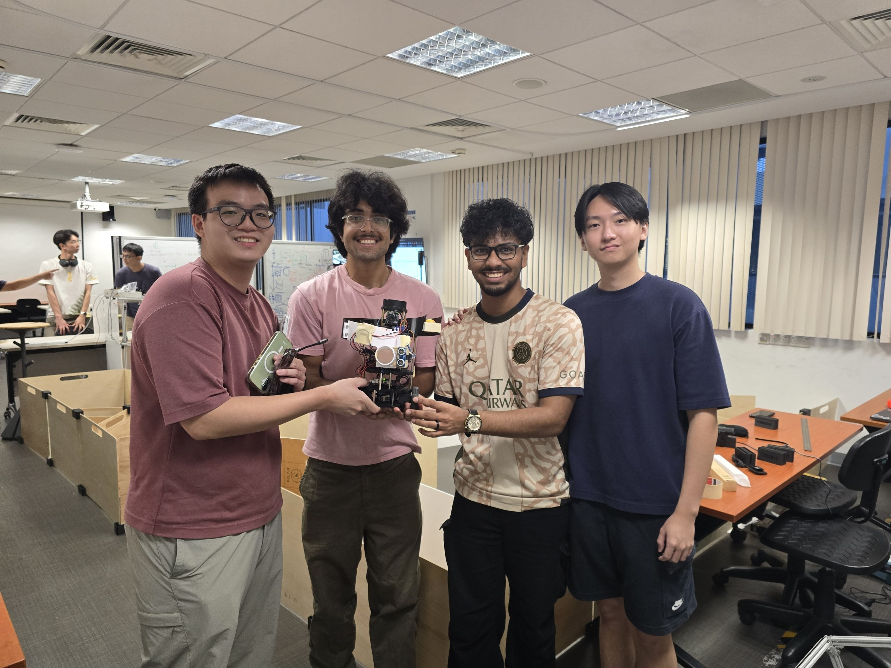
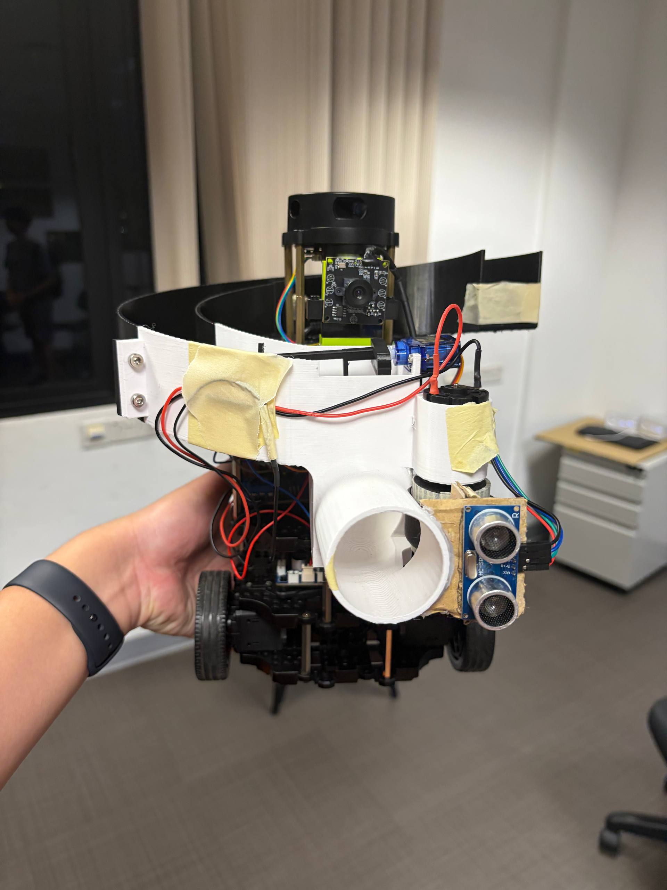
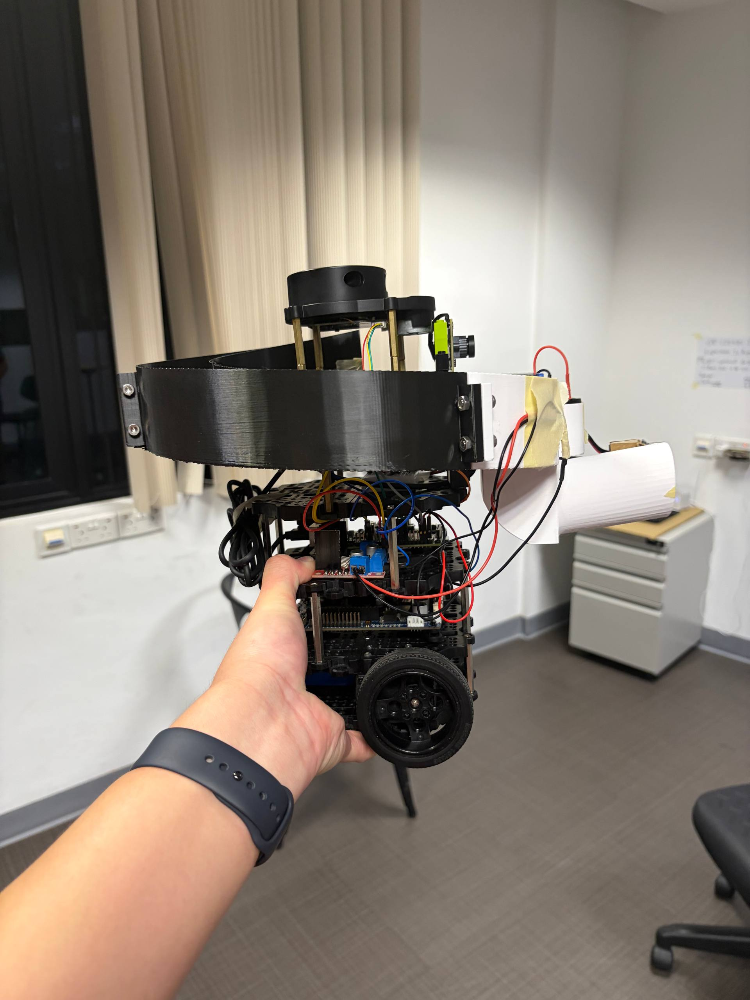
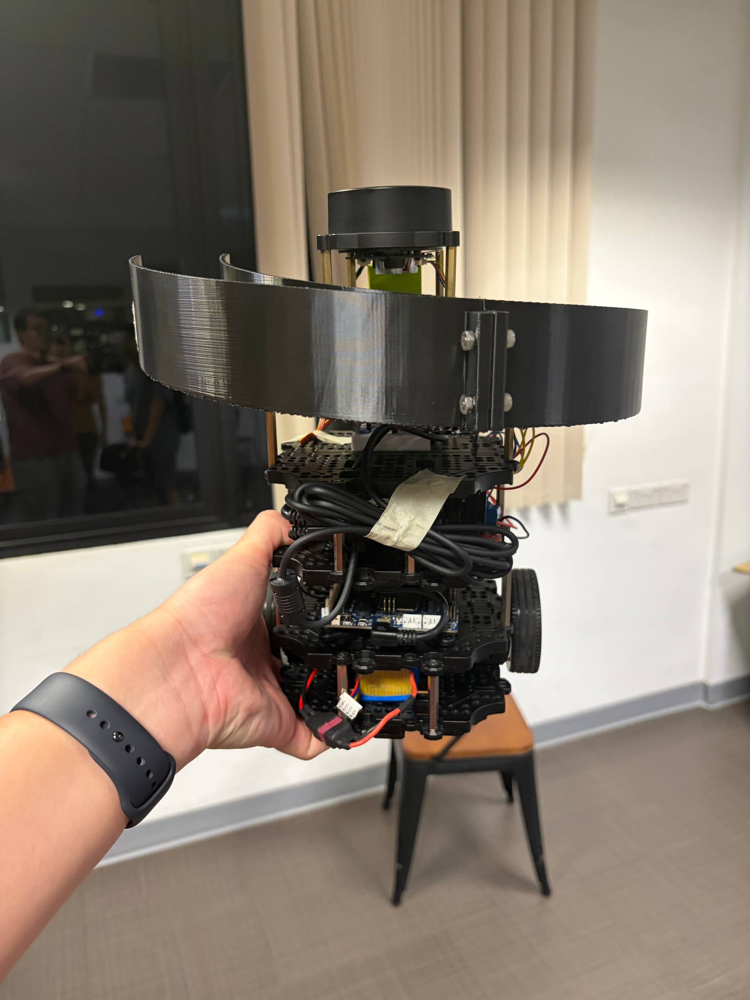

# GROUP 2 REPOSITORY FOR CDE2310 - FUNDAMENTALS OF SYSTEMS DESIGN 

## THE TEAM BEHIND   
  
Left to Right: LOO ZHONG EN SAMUEL, UDAIYAN BHAN, ARAVIND THEJUS, REAGAN MOSES WIDJAJA   

## ROBOT PHOTOS  
  
Front View  

  
Side View  

  
Back View

## INTRODUCTION  
### MISSION OVERVIEW  
For this project, we are tasked to design and build an Autonomous Mobile Robot that can handle and execute complex warehouse logistics. The robot must be able to self-navigate, identify visual landmarks, and deliver its payloads precisely, and sequentially if required, at each station. As a challenge, one of the stations will have a moving target.

### Mission Objectives
Our mission objectives can be broken down into two stages:   
**Stage 1:** Primary Objectives
+ Identify the Station through Visual Markers
+ Align and dock within allowable docking distance
+ Track the motion profile of the target, if required
+ Unload a payload batch (3 Ping Pong Balls) into the target receptacle, in fixed timing sequence if required    

**Stage 2:** Bonus Objectives
+ Identify the Lift Lobby & Final station through Visual Markers
+ Initiate and Use API Calls to control a lift
+ Safely travel to the second level
+ Unload the final payload batch (3 Ping Pong Balls) at the final station

> **NOTE:** The codebase deployed during the final Mission does not include capabilities to execute the bonus mission. 

### Constraints
The mission has the following constraints:
1. Timing
* Mission set-up, deployment and teardown must be done within 25 minutes
* The Robot System must be designed, built and fully functional by Week 12
2. Navigation
* The Robot must rely on its sensors’ data to map out its surroundings and for navigation.
* Navigation methods which uses line-following is not allowed
3. Environment
* The gaps between maze wall panels may cause issues the LiDAR reading

### REQUIREMENTS  
We have defined our requirements as such:  

### CON-OPS

The mission runs end-to-end as a single autonomous sequence, with the **external controller laptop (ECL)** handling perception, planning, and mission logic, and the **Raspberry Pi (RPI)** handling on-board sensor drivers and the payload launcher. A manual **E-stop** is available at all times via the `/cmd_vel` kill path on the TurtleBot3 base.

**Phase 0 — Setup (pre-run, ≤ 25 min window starts)**
- Battery checked, USB and OpenCR links verified, ECL and RPI joined to the same ROS 2 domain, RViz launched, ArUco markers placed at the two stations, balls loaded into the storage housing.
- Bring-up order: TurtleBot3 base (OpenCR serial bridge) → LiDAR → USB camera → ArUco node → SLAM → `autopilot_node` (ECL) and `rpi_live_code` (RPI).

**Phase 1 — Initialisation**
- TF tree completes (`map` → `odom` → `base_footprint` → `base_link` → camera frames).
- First `OccupancyGrid` arrives on `map`; `autopilot_node` enters **`PLANNING`**.

**Phase 2 — Frontier Exploration**
- **`PLANNING`**: BFS over the pooled occupancy grid scores frontier candidates (unknown-neighbour count + wall-distance bonus) and selects a goal; `A*` on the pooled/inflated grid returns a path; LOS pruning, wall-repulsion, and wall-safe smoothing are applied.
- **`DRIVING`**: Regulated Pure Pursuit tracks the path at up to 0.22 m/s; LiDAR sector checks run every control tick (10 Hz).
- **`RECOVERY` / `ESCAPING`**: Triggered on repeated obstacle hits or when the controller reports a near-U-turn; rotates toward the clearer sector, drives out briefly, then replans.
- Exploration continues until an ArUco marker from `valid_station_ids = [0, 1]` enters the camera view within 2.5 m **and** `|alpha| < 10°`.

**Phase 3 — Docking (Polar Arc)**
- On a valid detection, the controller clears its path, stops the base, and switches to **`DOCKING`**.
- Control law runs at 10 Hz directly from camera-frame ArUco pose: `v = k_rho · rho`, `w = -k_alpha · alpha`, clamped to `dock_max_v = 0.12 m/s` and `dock_max_w = 0.10 rad/s`.
- If the marker is lost for `≤ 0.75 s`, the base rotates toward the last-known `alpha` to re-acquire; beyond that, the dock aborts and the state returns to `PLANNING`.
- Dock completes when `rho ≤ 0.30 m` → state transitions to **`STATION`**.

**Phase 4 — Payload Delivery (ECL ↔ RPI handoff)**
- ECL publishes **`A`** or **`B`** on `/gpio_commands` based on `current_docking_id` (0 → A, 1 → B).
- RPI executes the station routine:
  - **Station A** — timed sequence: flywheel spin-up → drop → 7.5 s wait → drop → 2.0 s wait → final drop.
  - **Station B** — ultrasonic tripwire: flywheel held on; each drop fires when the HC-SR04 sees the leading edge of the receptacle (`< 15 cm` after a `> 30 cm` gap), for 3 drops total.
- RPI publishes **`A COMPLETE`** or **`B COMPLETE`** on `rpi_response`; ECL sets the matching mission flag.

**Phase 5 — Undocking & Return to Exploration**
- **`UNDOCKING`**: base reverses at `-0.08 m/s` for 2.0 s to clear the station face.
- State returns to `PLANNING`; frontier exploration resumes with the completed station ID masked out of re-docking.

**Phase 6 — Second Station**
- Repeat **Phase 2 → Phase 5** for the remaining station.

**Phase 7 — Continued Exploration / End of Run**
- As deployed for final evaluation (`r2CDE2310_FINAL.py`, `v1.5.2`), the `MISSION_COMPLETE` terminal state is disabled: after both `A COMPLETE` and `B COMPLETE` are received, the robot **continues exploring** to maximise map coverage and stops only when no further frontiers are reachable or the 25-minute window expires.

**Operator actions during the run** are limited to monitoring RViz (`planned_path`, `goal_marker`, `lookahead_marker`, marker detections) and, if needed, cutting `/cmd_vel` via the hardware E-stop.

## SYSTEM OVERVIEW
The system is a **TurtleBot3-class autonomous mobile platform** with a **Raspberry Pi 4**, **360° LiDAR**, **USB camera**, and a **custom ping-pong payload** (servo-fed chute, flywheel launcher, ultrasonic tripwire). Compute is split: a **remote laptop** runs ROS 2 navigation and mission logic (`auto_nav`, `r2CDE2310_FINAL.py`); an **onboard Raspberry Pi** runs sensor drivers, vision nodes as launched for the mission, and **GPIO** for payload actuation.

The mission loop: consume an **occupancy grid** for planning, **explore** until a valid **ArUco station marker** appears in the docking window, **dock** via polar-arc visual control, publish a **payload command** string, block on **completion** from the Pi, then repeat for the remaining station. **Line-following is not used**; motion is driven by LiDAR, map data, TF pose, and ArUco poses. The deployed evaluation configuration implements **Stage 1** (two stations); bonus lift/API behaviour is not present in the final mission stack (see Mission Objectives note above).

### HIGH LEVEL DESIGN
**Compute partitioning**

| Layer | Function |
|--------|----------|
| **Remote laptop** | `autopilot_node`: subscribes `map`, `scan`; TF (`map` ↔ `base_footprint` / `base_link`) for pose; frontier exploration; `A*` on pooled/inflated grid; **regulated pure pursuit**; **polar-arc ArUco docking**; publishes `cmd_vel`; debug topics `planned_path`, `goal_marker`, `lookahead_marker`; publishes `/gpio_commands`, subscribes `rpi_response`. |
| **Raspberry Pi** | Bring-up as deployed; **USB camera** (`usb_cam`, e.g. `cameralaunch.py`); **ArUco** pipeline (e.g. `usbcam1` → `/usbcam1_markers`); LiDAR over USB; **`rpilivecode`**: subscribes `gpio_commands`, commands **L298N**, **SG90**, **HC-SR04** (Station B), publishes `rpi_response`. |
| **OpenCR / base** | Differential drive from `cmd_vel`; TurtleBot3 motor interface. |

**Navigation stack**

- **Mapping**: `nav_msgs/OccupancyGrid` on `map` feeds grid-based planning (source: deployed SLAM / mapping stack).
- **Exploration**: Frontier search over free/unknown cells until station markers are acquired.
- **Global path**: `A*` search, 8-connected neighbourhood, downsampled grid, optional wall inflation; post-processing per [Software/README.md](./Software/README.md).
- **Local tracking**: **Regulated Pure Pursuit** on `cmd_vel`; LiDAR angular sectors feed obstacle and recovery logic in the control timer.

**Docking and payload**

- **Docking**: Polar-arc law from camera-frame ArUco (`rho`, `alpha`); FOV and marker-loss rules per [Software/README.md](./Software/README.md).
- **Payload handoff**: `autopilot_node` publishes **`A`** or **`B`** on `/gpio_commands`; `rpilivecode` executes Station A (timed drops) or Station B (ultrasonic tripwire); completion strings **`A COMPLETE`**, **`B COMPLETE`** on `rpi_response`.

**Power and structure**: **11.1 V LiPo** → **OpenCR** distribution; Pi **GPIO** for launcher; **USB** for camera and LiDAR. Mechanical: annular storage, feeder, flywheel - see [Mechanical](./Mechanical/mechanical.md), [Electrical](./Electrical/electrical.md).

### INTERFACE CONTROL
**ROS 2 connectivity**

Single ROS 2 domain; laptop and Pi on one L2/L3 path so **DDS** discovery succeeds. Topic names and namespaces must match the launch configuration.

| Direction | Topic / mechanism | Type / role |
|-----------|-------------------|-------------|
| → autopilot | `map` | `nav_msgs/OccupancyGrid` — planning, exploration |
| → autopilot | `scan` | `sensor_msgs/LaserScan` — sector masks, safety |
| → autopilot | `/usbcam1_markers` | `ros2_aruco_interfaces/ArucoMarkers` — station ID, pose |
| → autopilot | `rpi_response` | `std_msgs/String` — `A COMPLETE`, `B COMPLETE` |
| ← autopilot | `cmd_vel` | `geometry_msgs/Twist` — base velocity |
| ← autopilot | `/gpio_commands` | `std_msgs/String` — `A`, `B` |
| ← autopilot | `planned_path`, `goal_marker`, `lookahead_marker` | `nav_msgs/Path`, `visualization_msgs/Marker` — visualization |
| Pi | `gpio_commands` | Subscribe — resolves with `/gpio_commands` under default `/` namespace |
| Pi | `rpi_response` | Publish |

**Transforms**

`tf2_ros.Buffer` lookups: robot pose in `map` for planning and tracking (e.g. `map` → `base_footprint`). Camera and marker frames per URDF/calibration in the deployed launch.

**GPIO (BCM)**

| Signal | GPIO |
|--------|------|
| SG90 servo | 12 |
| L298N ENA (PWM) | 13 |
| L298N IN1 / IN2 | 25 / 8 |
| HC-SR04 TRIG / ECHO | 24 / 23 |

**Payload protocol**

- **Downlink** (laptop → Pi): `A` → Station A routine; `B` → Station B routine (`rpilivecode.py`).
- **Uplink** (Pi → laptop): `A COMPLETE`, `B COMPLETE` → `autopilot_node` mission flags; both flags set → mission-complete state.

## SUBSYSTEM DOCUMENTATIONS
### ELECTRICAL 
[Electrical Documentation](./Electrical/electrical.md)

### MECHANICAL
[Mechanical Documentation](./Mechanical/mechanical.md)

## SOFTWARE CODEBASE   
[Remote Laptop](./Software/Remote_Laptop/)   
[RPI](./Software/RPI/)  

## TESTING DOCUMENTATION

## USER MANUAL  
[User Manual](./General%20Docs/Group2_User_Manual%20-%20Google%20Docs.pdf)

## FINAL RUN VIDEOS LINK   
[Final Run](https://drive.google.com/drive/folders/1luweJNYKmffXvNXEVjMBalpTRKWKpJ6U?usp=sharing)