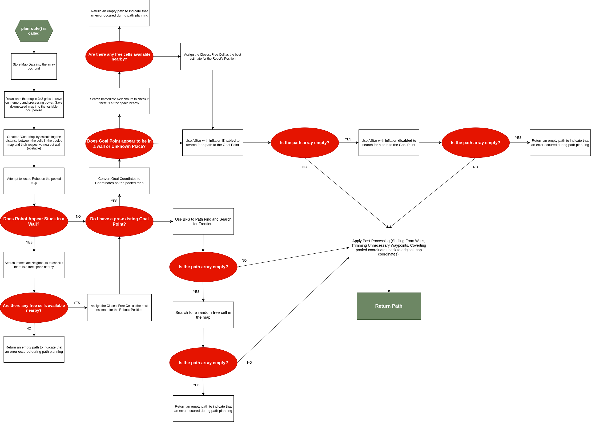
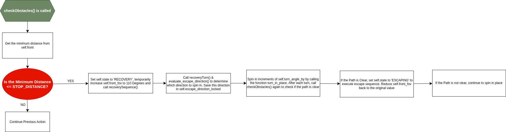
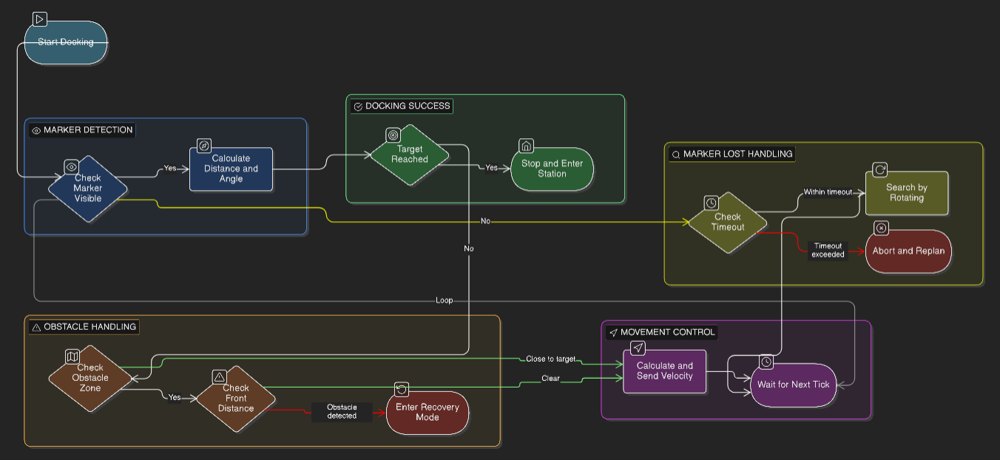

# SOFTWARE DEVELOPMENT   
This folder contains the codebase deployed on both the external controller laptop (ECL) as well as the Raspberry Pi 4B deployed on the TurtleBot3 (RPI).  

The Software makes use of the Robot Operating System 2 (ROS2) Framework with dedicated publisher &/or subscriber nodes for ArUco Marker Tracking, Autonomous Navigation, Docking and coordination between the ECL and RPI for Payload Delivery. We will now break down the High Level Design for each individual components. 

## HIGH LEVEL DESIGN  

The Flowchart below gives a High Level Description of the control flow for Navigation & Docking:  


## ArUco MARKER DETECTION & TRACKING  
**ArUco Marker Specifications:**  
+ **DICTIONARY:** 5X5, 250mm   

**Subscriptions:**  
+ `/hdcam0/image_raw/compressed`: Compressed Video Stream from USB Camera Used  
+ `/hdcam0/camera_info`: Camera Calibration Information of the USB Camera Used  

**Publishers:**  
+ `usbcam1_poses`: Detected ArUco Marker(s) respective Positional & Orientation Data(s) with respect to the Camera's Frame  
+ `usbcam1_markers`: Detected ArUco Marker(s) Identification Number (ID) and their respective Positional & Orientation Data(s) with respect to the Camera's Frame  

Details on the ROS2 Node for this purpose can be found here: [ros2_aruco](./Remote_Laptop/Live_Code/Aruco%20Marker%20Tracking/)

## NAVIGATION & DOCKING  
Our Deployed Navigation & Docking Program is executed on an **ECL**. The codebase can be found here: [r2CDE2310_FINAL.py](./Remote_Laptop/Live_Code/r2CDE2310_FINAL.py)  

We will break down the individual classes and functions in the `r2CDE2310_FINAL.py` codebase.  

### NAVIGATION  
Our Navigation Alogorithm Consists of Three Main Classes:  
1. `RegulatedPurePursuit()`  
1. `MapNode()`  
1. `AutoPilot(Node)`  

Let us breakdown each of the different classes.  

### RegulatedPurePursuit   
As the name suggests, this is a helper class that makes use of Regulated Pure Pursuit Principles to calculate and return movement commands in order for the robot to reach a set goal point in a given path. The details of the class is as such:  

**PARAMETERS**  
| PARAMETER | DESCRIPTION | CURRENT SETTING | TUNABLE |
|---------|-----------|:-------------:|:-----:|
|`self.lookaheaddist`|Distance which the controller uses to select the next target waypoint in a given path|0.35|YES|
|`self.max_speed`|Maximum linear speed the TurtleBot3 can travel at|0.22|YES*|
|`self.min_speed`|Minimum linear speed the TurtleBot3 can travel at|0.04|YES|
|`self.max_angular_v`|Maximum Angular Velocity of the TurtleBot3|0.60|YES|
|`self.max_angular_v_hard`|Maximum Angular Velocity for Tight turns|1.0|YES|
|`self.safety_factor`|Determines how fast or slow the TurtleBot3 Travels at depending on how steep the curavture is|3.0|YES|
|`self.slow_turn_threshold`|Minimum Angle (in Radians) which the the TurtleBot3 will execute a slow turn to reach the waypoint|1.20|YES|
|`self.rotate_threshold`|Minimum Angle (in Radians) which the TurtleBot3 will execute a spin on the spot to face the waypoint|2.60|YES|

> **NOTE:** The maximum linear speed that the TurtleBot3 can reach is 0.22m/s. As such, for any values of `self.max_speed` greater than 0.22m/s, it will automatically be published as 0.22.  

**FUNCTIONS**  

`findpoint()`  
* Arguments:  
    * `cur_x`: Current x-coordinate of the TurtleBot3 on the map  
    * `cur_y`: Current y-coordinate of the Turtlebot3 on the map  
    * `path`: An array, determined by the path planning algorithm, that contains waypoints that lead to a defined Goal Point
* Returns:
    * Sets `target` to be the first waypoint beyond `self.lookaheaddist` away from the current TurtleBot3's position  

`command()`
* Arguments:
    * `cur_x`: Same as `findpoint()`
    * `cur_y`: Same as `findpoint()`
    * `cur_yaw`: Heading Angle of the TurtleBot3 with respect to the map
    * `path`: Same as `findpoint()`
* Returns:  
    * `twist`: Computed linear speed & angular velocity for the TurtleBot3 to execute to reach the target waypoint. However, what it returns is situation dependent. The flowchart below explains this process in detail:  
    

### MapNode  
This helper class is used by our Breadth First Search (BFS) Path Planning Algorithm to categorise each of the coordinates on the map as well as generate a list of neighbours for each point.  

**PARAMETERS**  
| PARAMETER | DESCRIPTION |
|-----------|-------------|
|`self.x`|x-coordinate of point on the map with respect to the map frame|
|`self.y`|y-coordinate of the point on the map with respect to the map frame|
|`self.parent`|The parent of the point|

**FUNCTIONS** 
`generate_neighbours()`  
* Arguments:
    * `max_x`: maximum x-value along the x-axis of the map frame  
    * `max_y`: maximum y-value along the y-axis of the map frame  
* Returns:
    * `neighbours`: an array of adjacent neighbours to the point on the map

### AutoPilot  
The `AutoPilot` Class is arguably, the most important class in the entire `r2CDE2310_FINAL.py` codebase. It contains the logic for Path Planning, Docking, Obstacle Avoidance, as well as coordinates control handoff between the ECL and RPI for Payload Delivery. Since this section is with regards to Navigation, we will only focus on key parameters & functions that enables the TurtleBot3 to move around its environment autonomously.  

**Navigation Subscriptions:**  
* `/map`: For `OccupancyGrid` Information, provides details on the current position of the TurtleBot3, as well as a map of its current surroundings, used for path planning
* `/scan`: For LiDAR Data, used in obstacle avoidance
* `/base_link`: Current Positional Data of the Robot with respect to the map frame

**Navigation Publishers:**  
* `/cmd_vel`: For Publishing Linear Speed and Angular Velocity Commands to allow the TurtleBot3 to move
* `/goal_marker`: Allows users to visualise the current Goal Point that the TurtleBot3 is heading towards on RVis
* `/lookahead_marker`: Allows users to visualise the current waypoint that the TurtleBot3 is moving to along the Path to the Goal Point on RVis
* `/planned_path`: Alows users to visualise the overall path planned on RVis  

**Navigation Parameters**  
| PARAMETER | DESCRIPTION | CURRENT SETTING | TUNABLE |
|:---------:|-------------|:---------------:|:-------:|
|`STOP_DISTANCE`|Front Distance at which the Obstacle Avoidance Sequence will Trigger|0.30|YES|
|`SIDE_THRESHOLD`|Side Distance at which Obstacle Avoidance Sequence will Trigger|0.25|YES|
|`GOAL_THRESHOLD`|Distance from Goal Point to Robot in which it is considered as Goal Reached|0.25|YES|
|`SCANFILE`|File in which LiDAR Data is saved in for Diagnostics|lidar.txt|YES|
|`MAPFILE`|File in which Map Data is saved in for Diagnostics|map.txt|YES|
|`WALL_THRESHOLD`|Value of Cells in the map which are considered as obstacles|50|YES|
|`INFLATE_RADIUS`|Inflation Radius Value for AStar Path Planning|0|YES|
|`DIRECTIONS_8`|Array of cardinal directions that allows the AStar Path Planner to generate and search surrounding neighbours|refer to codebase|NO|
|`self.path`|An Array of Waypoints returned by the path planning algorithm for the Robot to follow|NA|NO|
|`self.boink`|A Tracker to count the number of times the Robot Encounters an obstacle as it moves to the Goal Point|0|NO|
|`self.goal`|X & Y Coordinates of the Goal Point Found during Path Planning|None|NO|
|`self.state`|State Tracker of Robot for State Machine Logic|'PLANNING'|NO|
|`self.rotation_start_time`|Time which the Robot started to Turn on the Spot|None|NO|
|`self.escape_direction_locked`|The Direction in which the Robot will rotate towards during the Recovery Sequence|None|NO|
|`self.escape_start_time`|Time which the Robot started its escape sequence|None|None|
|`self.escape_duration`|Time (in seconds) for which the Robot will move during the escape sequence|1.0|YES|
|`self.escape_speed`|Speed in which the Robot will move at during the escape sequence|0.15|YES|
|`self.front_fov`|Front LiDAR Field of View (FOV) of the Robot|80|YES|
|`self.turning_timeout`|Cut off timing to prevent the Robot from rotating on the spot for excessive periods|8.0|YES|
|`self.recovery_angle`|Angle which the Robot aims to turn to during the Recovery Sequence|None|NO|
|`self.turn_angle_by`|Angle Steps (in Radians) that the Robot will Turn in during the Recovery Sequence|pi/18 (10 Degrees)|YES|
|`self.wallinfdist`|Dictates how far the robot looks around each path waypoint to check for walls|3|YES (must be integers)|
|`self.maxshift`|Maximum value that path waypoints are shifted by with respect to the nearest wall|1,5|YES|
|`self.pre_recovery_state`|Saves the current state of the Robot before the recovery sequence is executed|None|NO|
|`self.front`|Array of LiDAR Data points that makes up the Front FOV|NA|NA|
|`self.left`|Array of LiDAR Data points that makes up the Left FOV|NA|NA|
|`self.right`|Array of LiDAR Data points that makes up the Right FOV|NA|NA|
|`self.back`|Array of LiDAR Data points that makes up the Back FOV|NA|NA|
|`self.res`|Resolution of the Map|NA|NA|
|`self.origin`|Map Origin|NA|NA|
|`self.occdata`|Array to Store Map Data from `/map` subscription|NA|NA|
|`self.timer`|Loop Frequency at which `self.controller` is called at to ensure smooth operation|`timer_period` = 0.1|NO|

**Utility Functions**  
`_line_of_sight()`  
* Arguments:  
    * `x0`, `y0`: x and y coordinates of first cell on the pooled (downscaled) map  
    * `x1`, `y1`: x and y coordinates of the second cell on the pooled (downscaled) map
    * `occ_pooled`: Downscaled Map
    * `wall_dist`: Distance Transform Map (or simply, a cost map) which stores the calculated distance between map cells to their respective nearest wall
* Returns:
    * A Boolean value deepending on whether the straight line between two pooled-grid cells is free of walls and stays at least 1 cell away from any wall

`get_orientation()`  
* Returns:
    * Current Orientation of the Robot

`stopbot()`  
* Returns:
    * Publishes a `/cmd_vel` topic to stop the Robot  

**Path Planing Functions** 
The Flowchart Below Gives a High-Level Breakdown of the process behind Path Planning:


`planroute()`
* Arguments:
    * `goal`: Defined Goal Point that the Robot is going to  
    * `allow_unknown`: Boolean to control whether the Robot is allowed to travel to an unknown area in the Map
* Returns:
    * `path`: Planned Route to the Found Goal Point, empty if otherwise

`_astar()`  
* Arguments:
    * `sx` & `sy`: Starting Point Coordinates on the pooled map
    * `gx` &`gy`: Goal Point Coordinates on the pooled map
    * `pooled_w`: Width of pooled map
    * `pooled_h`: Heigh of pooled map
    * `use_inflation`: Boolean to control whether the AStar search uses inflation
> **Note**: `occ_pooled` and `wall_dist` are the same as `planroute()`
* Returns:
    * `path`: The raw path found to the Goal point, empty if otherwise
    * `True`: Sets `found_path` to True if a valid path is found, `False` otherwise

`_bfs_frontier()`  
* Arguments:
    * `sx` & `sy`
    * `gx` &`gy`
    * `pooled_w`
    * `pooled_h`
    * `occ_pooled`
    * `wall_dist`
* Returns:
    * `raw_path`: The raw path found to the Goal point, empty if otherwise
    * `True`: Sets `found_path` to True if a valid path is found, `False` otherwise

#### A* Path Planning — In Depth

When the robot has a specific goal (a BFS-found frontier cell or a docking staging point), A* finds the shortest safe path through the occupancy grid.

**Map Preprocessing**

Before any search, the raw SLAM occupancy grid is preprocessed into a coarser, safer representation:

```
Raw OccupancyGrid  (e.g. 480 × 480 cells @ 0.05 m/cell)
         │
         │  3× max-pool (every 3×3 block → single cell, take max value)
         ▼
  Pooled grid  (~160 × 160 cells @ 0.15 m/cell)
         │
         │  binary_dilation(walls, iterations=1)
         │  — thickens single-pixel wall features that pooling might thin out
         ▼
  Dilated wall mask
         │
         │  distance_transform_edt(~dilated_walls)
         ▼
  wall_dist  — each cell holds its Euclidean distance (in cells) to the nearest wall
```

**Why max-pool?** Taking the maximum occupancy value per block means any wall touching a 3×3 region propagates to the pooled cell — conservative and safe. Free-space only registers as free if the entire block is clear.

**Why binary dilation before EDT?** Thin walls (single-pixel features common in SLAM maps) can disappear at the pooled resolution. Dilating before computing wall distances ensures the planner sees these features and routes away from them.

**Resolution trade-off:** A* on the 160×160 pooled grid is roughly 9× faster than running it on the full 480×480 grid, with negligible path quality loss since the robot itself is ~0.18 m wide and the 0.15 m pooled cell size is already sub-robot.

**Cost Function**

```
f(n) = g(n) + h(n)

g(n) = move_cost + proximity_penalty
     = (1.0 or 1.414)  +  (5.0 / max(wall_dist, 0.5))

h(n) = Euclidean distance to goal   [admissible — never overestimates]
```

| Move direction | move_cost |
|----------------|-----------|
| Cardinal (N/S/E/W) | 1.000 |
| Diagonal (NE/NW/SE/SW) | 1.414 (≈ √2) |

8-directional connectivity means paths can take diagonal shortcuts across open space, reducing total path length by up to ~30% compared to 4-connected Manhattan routing.

The proximity penalty creates a potential field that naturally centres paths in corridors:

| wall_dist (cells) | Approx clearance | Penalty |
|-------------------|-----------------|---------|
| 0.5 (minimum clamp) | 0.075 m | 10.0 |
| 1 | 0.15 m | 5.0 |
| 2 | 0.30 m | 2.5 |
| 3 | 0.45 m | 1.67 |
| 5 | 0.75 m | 1.0 |
| 10 | 1.50 m | 0.5 |

A path hugging a wall at `wall_dist = 1` pays +5.0 per step; the same path shifted one cell toward the centre drops to +2.5 — a 50% penalty reduction. The planner steers away from walls without ever explicitly forbidding near-wall cells.

**Wall Inflation**

A hard exclusion zone can be enabled on top of the soft penalty:

```
if wall_dist[ny, nx] ≤ INFLATE_RADIUS  AND  (ny, nx) ≠ goal:
    skip this cell entirely
```

The goal cell is exempted so that goals near walls (e.g. staging points 0.40 m from a dock) remain reachable. If A* fails with inflation enabled, it retries without — handling narrow corridors that are physically navigable but fall inside the inflation radius on the coarse pooled grid.

**Unknown Space:** By default A* refuses to route through unknown cells (occupancy = −1). When navigating to a docking staging point, `allow_unknown=True` is passed since the staging point is often in unmapped space directly in front of a newly detected marker.

**Path Post-Processing**

Four stages convert the raw A* output into a smooth, wall-safe path in map coordinates:

```
Raw A* output:  [(x0,y0), (x1,y1), ..., (xN,yN)]  (pooled cells)
        │
        ▼  Stage 1 — LOS Pruning
        │   For each waypoint i, find furthest j where straight line i→j
        │   clears all walls AND stays wall_dist > 2.0 cells throughout.
        │   Drop all waypoints between i and j.
        │   Sampled at 3× the segment length for sub-cell accuracy.
        │
        ▼  Stage 2 — Wall-Repulsion Shift
        │   Each waypoint is pushed away from nearby walls using an
        │   inverse-distance repulsion force (capped at maxshift = 1.5 cells).
        │   Falls back to 25% shift if full shift lands inside a wall.
        │
        ▼  Stage 3 — Convert to Map Coordinates
        │   mx = (sx × 3 + 1.5) × resolution + origin.x
        │   (the +1.5 centres the coordinate within the pooled cell)
        │
        ▼  Stage 4 — Wall-Safe Moving-Average Smoothing
            5-point window average per waypoint.
            Each smoothed candidate is validated: if it falls inside a wall
            or within 1.5 cells of one, the original point is kept instead.

Final output:  MapNode list in map-frame metres, ready for RPP
```

**Why keep the original during smoothing?** A naive moving average can pull waypoints into walls in tight corners. The wall-distance check ensures smoothing only applies where there is genuine clearance.

| Parameter | Value | Effect |
|-----------|-------|--------|
| wallinfdist | 3 cells | Wall repulsion search radius |
| maxshift | 1.5 cells | Maximum repulsion displacement |
| Smoothing window | 5 waypoints | Moving average half-width |
| LOS wall_dist guard | 2.0 cells | Minimum clearance for LOS shortcuts |

---

**Obstacle Avoidance & Recovery Functions**
The Flowchart Below Gives a High-Level Breakdown of the Obstacle Avoidance & Recovery Process:


`checkObstacles()`  
* Returns:
    * `True`: Obstacle Found
    * `False`: No Obstacles Present

`turn_in_place()`
* Arguments:
    * `target_angle`: Target Angle that the Robot Needs to face
    * `current_angle`: Current Angle the Robot is Facing
* Returns:
    * Publishes a `twist` command to get the robot to spin in place in the desired direction

`evaluate_escape_direction()`  
* Returns:
    * `-self.turn_in_place`: Indicates the Robot Should Spin in the **counter-clockwise** Direction (Left has larger Clearance)
    * `self.turn_in_place`: Indicates that the Robot Should Spin in the **clockwise** direction (Right has larger clearance)

`recoveryTurn()`  
* Returns:
    * `True`: Robot has **completed** recovery turn
    * `False`: Robot has **not completed** recovery turn

`recoverySequence()` 
Sets `self.sate` to `ESCAPING` if the path ahead is clear after the recovery turn has been executed. If the robot encounters 3 or more obstacles along the path to the same goal point, the goal point will be reset and `planroute()` will plan a path to a different goal.

## DOCKING

Two independent docking strategies were implemented and evaluated. Both share the same trigger: when `marker_callback` detects a valid ArUco marker within 2.5 m, the robot stops, clears its current navigation path, and switches to the docking branch of the state machine.

### Marker Detection Gate

Both strategies apply the same angular gate before triggering:

```python
alpha = atan2(marker_x, marker_z)   # bearing in camera frame
if abs(alpha) > radians(10):
    # Marker is too far to the side — ignore, keep navigating
    return
```

If the bearing exceeds ±10°, the detection is ignored and the robot continues on its current navigation path. As the robot moves, the marker naturally enters the ±10° window when the robot is roughly facing it — at which point docking triggers cleanly. This is a **passive gate**, not active alignment — the robot does not deliberately turn toward the marker.

This prevents the polar arc controller from starting at a wide oblique angle where convergence is slow, and prevents the 3-phase approach from computing a staging point from noisy pose data.

---

### Polar Arc Docking *(Final Evaluation — Used)*

The polar arc controller drives a smooth converging curve from wherever the robot is standing directly to the dock face. No intermediate waypoints, no phases — just a continuous control law running at 10 Hz.



**Camera Frame & Polar Coordinates**

```
         Z  (forward, camera axis)
         ▲
         │        ● ArUco marker
         │       ╱
         │  rho ╱
         │     ╱
         │    ╱  α (alpha, positive = marker to the right)
         │   ╱
         ●──────────────────────────► X (right)
       robot

rho   = sqrt(marker_x² + marker_z²)     distance to marker
alpha = atan2(marker_x, marker_z)        lateral bearing (0 = straight ahead)
```

All measurements come directly from the ArUco pose in the camera frame — no TF transform, no localisation dependency. The controller steers to zero alpha while reducing rho.

**Control Law**

```
v =  dock_k_rho   × rho       →  approach speed, proportional to remaining distance
w = −dock_k_alpha × alpha     →  steer to centre marker in view

Clamped:
  v = clamp(v, 0, dock_max_v)
  w = clamp(w, −dock_max_w, dock_max_w)
```

As rho decreases, v decreases proportionally — the robot naturally decelerates on approach. As alpha decreases, w decreases — steering self-corrects. The two channels are independent and stable.

**Why dock_max_w = 0.10 rad/s is deliberately slow:** Early tests used `max_w = 0.50 rad/s`. At that rate, small noisy alpha readings caused aggressive angular corrections that made the robot weave and overshoot laterally in the final metre. Capping at 0.10 rad/s forces slow, deliberate steering — the robot takes a wider arc but arrives straight and centred. Note that with `dock_k_alpha = 1.8`, the angular output is clamped for virtually any non-zero alpha — the gain drives aggressive centring intent, but the clamp enforces the slow physical rate throughout.

**Parameters**

| Parameter | Value | Justification |
|-----------|-------|---------------|
| `dock_k_rho` | 0.30 | 1 m away → 0.30 m/s forward; 0.5 m → 0.15 m/s |
| `dock_k_alpha` | 1.8 | High gain intent; always clamped to dock_max_w in practice |
| `dock_max_v` | 0.12 m/s | Below TurtleBot3 slippage threshold on smooth floor |
| `dock_max_w` | 0.10 rad/s | Suppresses jitter; forces smooth arc over weave |
| `dock_target_dist` | 0.30 m | Stop before physical contact |
| `dock_lost_timeout` | 0.75 s | Short enough to abort quickly; long enough to survive a dropped frame |

**Loss Recovery**

```
marker_visible = True
    → run control law as above

marker_visible = False,  elapsed ≤ 0.75 s
    → continuously publish slow rotation toward last known alpha direction
      (0.10 rad/s, sign from dock_last_alpha)
    → re-acquire marker as it re-enters camera FOV

marker_visible = False,  elapsed > 0.75 s
    → stopbot()
    → state = 'PLANNING'   (abort, resume exploration)
```

The last-known alpha direction is saved each frame so the recovery rotation turns the robot the correct way — toward where the marker was last seen.

**State Transitions**

```
DRIVING / PLANNING / SEARCHING
    │  marker_callback fires (|alpha| < 10°, dist < 2.5 m)
    ▼
  DOCKING ──────────────────────────────────────────► RECOVERY
    │  rho ≤ 0.30 m              (obstacle during approach)
    ▼
  STATION
```

---

### 3-Phase LiDAR Docking *(Tested, Not Used in Final)*

An alternative approach that removes continuous camera dependency after initial detection by navigating to a precomputed staging point and then using LiDAR for the final stop.

**Phase 1 — DOCK_NAV: Navigate to Staging Point**

On marker detection, the marker's Z-axis (normal to its face) is extracted from the ArUco quaternion and rotated into the map frame:

```python
nx, ny, _ = quat_rotate_vector(qx, qy, qz, qw, 0, 0, 1)
staging_x = marker_map_x + 0.4 * nx
staging_y = marker_map_y + 0.4 * ny
```

```
    ┌──────────────────────┐   ← dock wall
    │       ArUco          │
    └──────────●───────────┘
               │ marker normal (Z-axis)
               │  0.4 m
               ●  staging point
               │
               │  A* path
               │
              ●  robot
```

A* navigates to the staging point with `allow_unknown=True`. If A* cannot find a path, it retries up to 5 times from progressively closer positions. If the robot is within approximately 0.30–0.35 m of the staging point and planning still fails, it proceeds to rotation anyway. The exact fallback threshold varies slightly across file versions.

**Phase 2 — DOCK_ROTATE: Align to Marker Normal**

```python
dock_heading = atan2(ny, nx) + pi   # +π flips normal direction to face toward wall
```

Proportional controller rotates in place:
```
w = 2.0 × angle_error,  max_w = 0.15 rad/s
Stop when |angle_error| < 0.08 rad (~4.6°)
```

**Phase 3 — DOCK_STRAIGHT: Creep to Dock Face**

Drives straight at 0.08 m/s with no steering by default. A narrow ±10° LiDAR cone measures distance to the dock wall face:

```
Stop condition:  min(center_cone LiDAR) ≤ 0.20 m  →  STATION
```

Minor angular correction from the camera is applied if the marker is still visible during the creep. The 0.20 m stop distance (tighter than polar arc's 0.30 m) is possible because the straight approach is precisely aligned — there is no lateral arc to account for.

---

### Docking Comparison

| | Polar Arc | 3-Phase LiDAR |
|--|-----------|---------------|
| Approach | Smooth continuous curve | Navigate → rotate → creep |
| Camera dependency | Continuous throughout | Only at initial detection |
| Works from any angle | Yes, within ±10° gate | Yes — computes staging point |
| Localisation required | No (camera frame only) | Yes (staging point needs map frame) |
| Tight corridor behaviour | May arc wide in narrow spaces | Predictable straight-line final approach |
| Stop mechanism | Camera distance (rho ≤ 0.30 m) | LiDAR narrow cone (≤ 0.20 m) |
| Failure modes | Marker lost mid-arc, noisy alpha | Staging unreachable, rotation overshoot |
| Tuning required | k_rho, k_alpha, max_w | Staging distance, rotation tolerance |
| Implementation complexity | Low | High |
| **Used in final evaluation** | **Yes** | No |

The polar arc approach was selected for the final evaluation. It is simpler to reason about, has fewer states that can fail independently, and proved more reliable within the project timeline. The 3-phase approach introduced compounding failure modes: an unreachable staging point would abort the dock entirely, and even small rotation overshoots in Phase 2 cascaded into off-centre approaches in Phase 3. The polar arc controller handles these gracefully — any misalignment is continuously corrected by the alpha feedback term throughout the entire approach.
