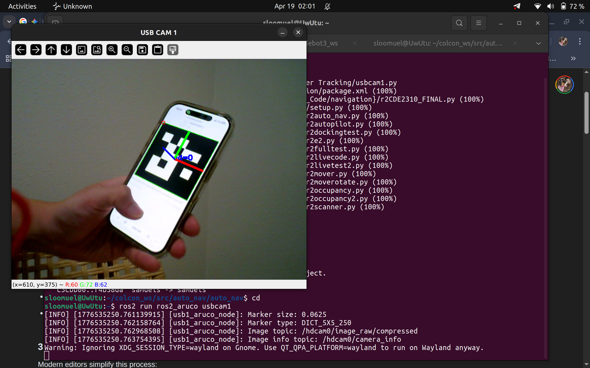
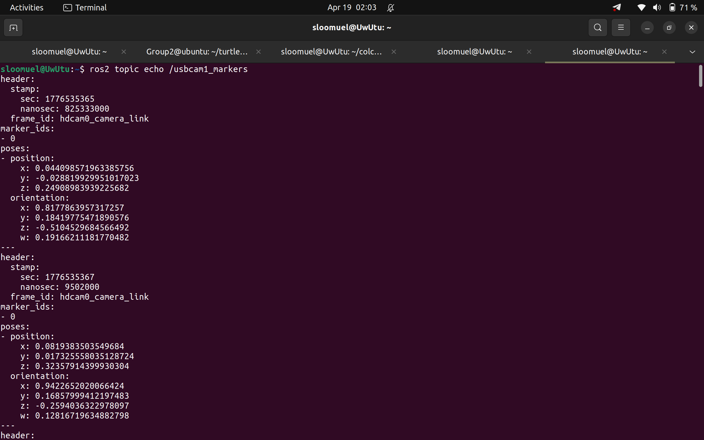

# ArUco Marker Detection & Tracking  

The algorithm for ArUco Marker Detection & Tracking uses a modified version of `ros2_aruco`, an open-source ROS2 Wrapper for OpenCV ArUCo Marker Tracking developed by JMU Robotics. The necessary GitHub Repository can be found here:  

[ros2_aruco](https://github.com/JMU-ROBOTICS-VIVA/ros2_aruco/tree/main)  

## Changes Made:  
1. Updated Code Syntax to support OpenCV version 4.10.0  
1. Changed `image_topic` subscription from `/camera/image_raw` to `/hdcam0/image_raw/compressed` which corresponds to the publisher for our USB Camera  
1. Changed `camera_info_topic` subscription from `/camera/camera_info` to `/hdcam0/camera_info`  
1. Added a Visualiser to allow users to see the real-time video stream from the USB Camera, as well as any ArUco Markers being Tracked  

> **Note:** For additional information on the code, visit the `ros2_aruco` GitHub Repository at the provided link.  

## Prerequisites  

Please ensure that you have calibrated 

## Set-Up  

1. Fork the `ros2_aruco` repository found via the link provided  
1. Follow the steps in the repository to install the necessary dependencies  
1. Navigate to your workspace `src` folder and clone the forked repository:  
```  
cd ~/colcon_ws/src  
git clone <insert_ssh_link>  
```  
1. Navigate to the following folder:  
```  
cd ~/colcon_ws/src/ros2_aruco/ros2_aruco  
```  
1. Replace the `package.xml` and `setup.py` files with the provided corresponding files  
1. Navigate to the following folder:  
```  
cd ros2_aruco  
```  
1. Copy the provided `usbcam1.py` file into the folder  
1. Rebuild the package:  
```  
cd ~/colcon_ws  
colcon build --packages-select ros2_aruco  
source install/setup.bash  
```
## Running the Code  

To run the code, first ensure that the camera video feed publisher is active. You can verify this by running the following command:  
```
ros2 topic list  
```  
and verify that both `/hdcam0/image_raw/compressed` and `/hdcam0/camera_info` are present.  

Thereafter, launch the node by running the following command:  
```
ros2 run ros2_aruco usbcam1   
```  

## Expected Outcome  

If the code has been executed correctly, you should see this on your screen:  
  

To see the the ID Number(s), Orientation and Positional Data of ArUco Marker(s) being detected relative to the camera's frame, you may do so with the following command:  
```   
ros2 topic echo /usbcam1_markers   
```  

If the code has been executed correctly and there are ArUco Marker(s) Present in the camera's field of view, you should see this on your screen:  
