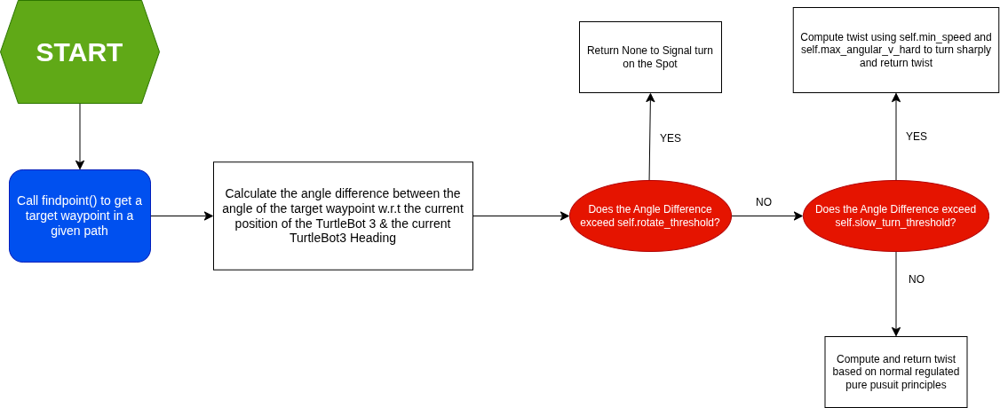

# SOFTWARE DEVELOPMENT   
This folder contains the codebase deployed on both the external controller laptop (ECL) as well as the Raspberry Pi 4B deployed on the TurtleBot3 (RPI).  

The Software makes use of the Robot Operating System 2 (ROS2) Framework with dedicated publisher &/or subscriber nodes for ArUco Marker Tracking, Autonomous Navigation, Docking and coordination between the ECL and RPI for Payload Delivery. We will now break down the High Level Design for each individual components. 

## HIGH LEVEL DESIGN  

The Flowchart below gives a High Level Description of the control flow for Navigation & Docking:  

## ArUco MARKER DETECTION & TRACKING  
**ArUco Marker Specifications:**  
+ **DICTIONARY:** 5X5, 250mm   

**Subscriptions:**  
+ `/hdcam0/image_raw/compressed`: Compressed Video Stream from USB Camera Used  
+ `/hdcam0/camera_info`: Camera Calibration Information of the USB Camera Used  

**Publishers:**  
+ `usbcam1_poses`: Detected ArUco Marker(s) respective Positional & Orientsation Data(s) with respect to the Camera's Frame  
+ `usbcam1_markers`: Detected ArUco Marker(s) Identification Number (ID) and their respective Positional & Orientsation Data(s) with respect to the Camera's Frame  

Details on the ROS2 Node for this purpose can be found here: [ros2_aruco](./Remote_Laptop/Live_Code/Aruco%20Marker%20Tracking/)

## NAVIGATION & DOCKING  
Our Deployed Navigation & Docking Program is executed on an **ECL**. The codebase can be found here: [r2CDE2310_FINAL.py](./Remote_Laptop/Live_Code/r2CDE2310_FINAL.py)  

We will break down the individual classes and functions in the `r2CDE2310_FINAL.py` codebase.  

### NAVIGATION  
Our Navigation Alogorithm Consists of Three Main Classes:  
1. `RegulatedPurePursuit()`  
1. `MapNode()`  
1. `AutoPilot(Node)`  

Let us breakdown each of the different classes.  

### RegulatedPurePursuit   
As the name suggests, this is a helper class that makes use of Regulated Pure Pursuit Principles to calculate and return movement commands in order for the robot to reach a set goal point in a given path. The details of the class is as such:  

**PARAMETERS**  
| PARAMETER | DESCRIPTION | CURRENT SETTING | TUNABLE |
|---------|-----------|:-------------:|:-----:|
|`self.lookaheaddist`|Distance which the controller uses to select the next target waypoint in a given path|0.35|YES|
|`self.max_speed`|Maximum linear speed the TurtleBot3 can travel at|0.22|YES*|
|`self.min_speed`|Minimum linear speed the TurtleBot3 can travel at|0.04|YES|
|`self.max_angular_v`|Maximum Angular Velocity of the TurtleBot3|0.60|YES|
|`self.max_angular_v_hard`|Maximum Angular Velocity for Tight turns|1.0|YES|
|`self.safety_factor`|Determines how fast or slow the TurtleBot3 Travels at depending on how steep the curavture is|3.0|YES|
|`self.slow_turn_threshold`|Minimum Angle (in Radians) which the the TurtleBot3 will execute a slow turn to reach the waypoint|1.20|YES|
|`self.rotate_threshold`|Minimum Angle (in Radians) which the TurtleBot3 will execute a spin on the spot to face the waypoint|2.60|YES|

> **NOTE:** The maximum linear speed that the TurtleBot3 can reach is 0.22m/s. As such, for any values of `self.max_speed` greater than 0.22m/s, it will automatically be published as 0.22.  

**FUNCTIONS**  

`findpoint()`  
* Arguments:  
    * `cur_x`: Current x-coordinate of the TurtleBot3 on the map  
    * `cur_y`: Current y-coordinate of the Turtlebot3 on the map  
    * `path`: An array, determined by the path planning algorithm, that contains waypoints that lead to a defined Goal Point
* Returns:
    * Target Waypoint that is the first waypoint beyond `self.lookaheaddist` away from the current TurtleBot3's position  

`command()`
* Arguments:
    * `cur_x`: Same as `findpoint()`
    * `cur_y`: Same as `findpoint()`
    * `cur_yaw`: Heading Angle of the TurtleBot3 with respect to the map
    * `path`: Same as `findpoint()`
* Returns:  
    * `twist`: Computed linear speed & angular velocity for the TurtleBot3 to execute to reach the target waypoint. However, what it returns is situation dependent. The flowchart below explains this process in detail:  
    

