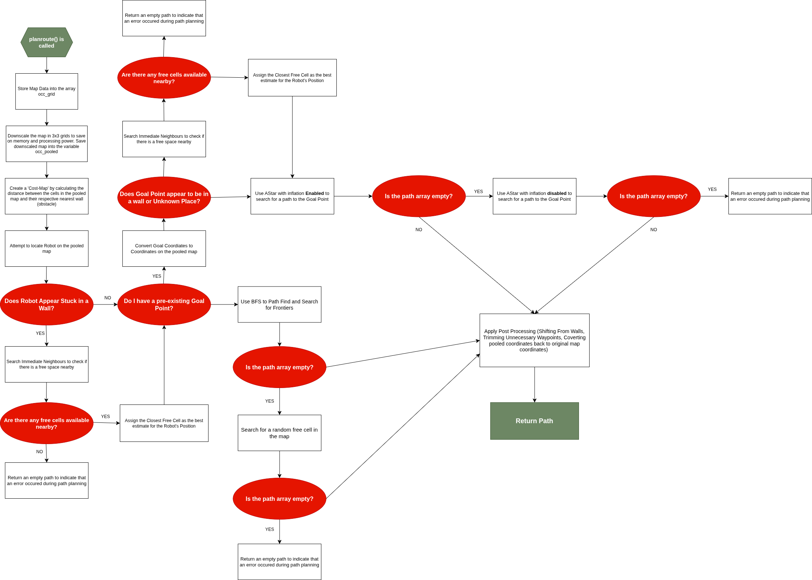

# SOFTWARE DEVELOPMENT   
This folder contains the codebase deployed on both the external controller laptop (ECL) as well as the Raspberry Pi 4B deployed on the TurtleBot3 (RPI).  

The Software makes use of the Robot Operating System 2 (ROS2) Framework with dedicated publisher &/or subscriber nodes for ArUco Marker Tracking, Autonomous Navigation, Docking and coordination between the ECL and RPI for Payload Delivery. We will now break down the High Level Design for each individual components. 

## HIGH LEVEL DESIGN  

The Flowchart below gives a High Level Description of the control flow for Navigation & Docking:  

## ArUco MARKER DETECTION & TRACKING  
**ArUco Marker Specifications:**  
+ **DICTIONARY:** 5X5, 250mm   

**Subscriptions:**  
+ `/hdcam0/image_raw/compressed`: Compressed Video Stream from USB Camera Used  
+ `/hdcam0/camera_info`: Camera Calibration Information of the USB Camera Used  

**Publishers:**  
+ `usbcam1_poses`: Detected ArUco Marker(s) respective Positional & Orientation Data(s) with respect to the Camera's Frame  
+ `usbcam1_markers`: Detected ArUco Marker(s) Identification Number (ID) and their respective Positional & Orientation Data(s) with respect to the Camera's Frame  

Details on the ROS2 Node for this purpose can be found here: [ros2_aruco](./Remote_Laptop/Live_Code/Aruco%20Marker%20Tracking/)

## NAVIGATION & DOCKING  
Our Deployed Navigation & Docking Program is executed on an **ECL**. The codebase can be found here: [r2CDE2310_FINAL.py](./Remote_Laptop/Live_Code/r2CDE2310_FINAL.py)  

We will break down the individual classes and functions in the `r2CDE2310_FINAL.py` codebase.  

### NAVIGATION  
Our Navigation Alogorithm Consists of Three Main Classes:  
1. `RegulatedPurePursuit()`  
1. `MapNode()`  
1. `AutoPilot(Node)`  

Let us breakdown each of the different classes.  

### RegulatedPurePursuit   
As the name suggests, this is a helper class that makes use of Regulated Pure Pursuit Principles to calculate and return movement commands in order for the robot to reach a set goal point in a given path. The details of the class is as such:  

**PARAMETERS**  
| PARAMETER | DESCRIPTION | CURRENT SETTING | TUNABLE |
|---------|-----------|:-------------:|:-----:|
|`self.lookaheaddist`|Distance which the controller uses to select the next target waypoint in a given path|0.35|YES|
|`self.max_speed`|Maximum linear speed the TurtleBot3 can travel at|0.22|YES*|
|`self.min_speed`|Minimum linear speed the TurtleBot3 can travel at|0.04|YES|
|`self.max_angular_v`|Maximum Angular Velocity of the TurtleBot3|0.60|YES|
|`self.max_angular_v_hard`|Maximum Angular Velocity for Tight turns|1.0|YES|
|`self.safety_factor`|Determines how fast or slow the TurtleBot3 Travels at depending on how steep the curavture is|3.0|YES|
|`self.slow_turn_threshold`|Minimum Angle (in Radians) which the the TurtleBot3 will execute a slow turn to reach the waypoint|1.20|YES|
|`self.rotate_threshold`|Minimum Angle (in Radians) which the TurtleBot3 will execute a spin on the spot to face the waypoint|2.60|YES|

> **NOTE:** The maximum linear speed that the TurtleBot3 can reach is 0.22m/s. As such, for any values of `self.max_speed` greater than 0.22m/s, it will automatically be published as 0.22.  

**FUNCTIONS**  

`findpoint()`  
* Arguments:  
    * `cur_x`: Current x-coordinate of the TurtleBot3 on the map  
    * `cur_y`: Current y-coordinate of the Turtlebot3 on the map  
    * `path`: An array, determined by the path planning algorithm, that contains waypoints that lead to a defined Goal Point
* Returns:
    * Sets `target` to be the first waypoint beyond `self.lookaheaddist` away from the current TurtleBot3's position  

`command()`
* Arguments:
    * `cur_x`: Same as `findpoint()`
    * `cur_y`: Same as `findpoint()`
    * `cur_yaw`: Heading Angle of the TurtleBot3 with respect to the map
    * `path`: Same as `findpoint()`
* Returns:  
    * `twist`: Computed linear speed & angular velocity for the TurtleBot3 to execute to reach the target waypoint. However, what it returns is situation dependent. The flowchart below explains this process in detail:  
    

### MapNode  
This helper class is used by our Breadth First Search (BFS) Path Planning Algorithm to categorise each of the coordinates on the map as well as generate a list of neighbours for each point.  

**PARAMETERS**  
| PARAMETER | DESCRIPTION |
|-----------|-------------|
|`self.x`|x-coordinate of point on the map with respect to the map frame|
|`self.y`|y-coordinate of the point on the map with respect to the map frame|
|`self.parent`|The parent of the point|

**FUNCTIONS** 
`generate_neighbours()`  
* Arguments:
    * `max_x`: maximum x-value along the x-axis of the map frame  
    * `max_y`: maximum y-value along the y-axis of the map frame  
* Returns:
    * `neighbours`: an array of adjacent neighbours to the point on the map

### AutoPilot  
The `AutoPilot` Class is arguably, the most important class in the entire `r2CDE2310_FINAL.py` codebase. It contains the logic for Path Planning, Docking, Obstacle Avoidance, as well as coordinates control handoff between the ECL and RPI for Payload Delivery. Since this section is with regards to Navigation, we will only focus on key parameters & functions that enables the TurtleBot3 to move around its environment autonomously.  

**Navigation Subscriptions:**  
* `/map`: For `OccupancyGrid` Information, provides details on the current position of the TurtleBot3, as well as a map of its current surroundings, used for path planning
* `/scan`: For LiDAR Data, used in obstacle avoidance
* `/base_link`: Current Positional Data of the Robot with respect to the map frame

**Navigation Publishers:**  
* `/cmd_vel`: For Publishing Linear Speed and Angular Velocity Commands to allow the TurtleBot3 to move
* `/goal_marker`: Allows users to visualise the current Goal Point that the TurtleBot3 is heading towards on RVis
* `/lookahead_marker`: Allows users to visualise the current waypoint that the TurtleBot3 is moving to along the Path to the Goal Point on RVis
* `/planned_path`: Alows users to visualise the overall path planned on RVis  

**Navigation Parameters**  
| PARAMETER | DESCRIPTION | CURRENT SETTING | TUNABLE |
|:---------:|-------------|:---------------:|:-------:|
|`STOP_DISTANCE`|Front Distance at which the Obstacle Avoidance Sequence will Trigger|0.30|YES|
|`SIDE_THRESHOLD`|Side Distance at which Obstacle Avoidance Sequence will Trigger|0.25|YES|
|`GOAL_THRESHOLD`|Distance from Goal Point to Robot in which it is considered as Goal Reached|0.25|YES|
|`SCANFILE`|File in which LiDAR Data is saved in for Diagnostics|lidar.txt|YES|
|`MAPFILE`|File in which Map Data is saved in for Diagnostics|map.txt|YES|
|`WALL_THRESHOLD`|Value of Cells in the map which are considered as obstacles|50|YES|
|`INFLATE_RADIUS`|Inflation Radius Value for AStar Path Planning|0|YES|
|`DIRECTIONS_8`|Array of cardinal directions that allows the AStar Path Planner to generate and search surrounding neighbours|refer to codebase|NO|
|`self.path`|An Array of Waypoints returned by the path planning algorithm for the Robot to follow|NA|NO|
|`self.boink`|A Tracker to count the number of times the Robot Encounters an obstacle as it moves to the Goal Point|0|NO|
|`self.goal`|X & Y Coordinates of the Goal Point Found during Path Planning|None|NO|
|`self.state`|State Tracker of Robot for State Machine Logic|'PLANNING'|NO|
|`self.rotation_start_time`|Time which the Robot started to Turn on the Spot|None|NO|
|`self.escape_direction_locked`|The Direction in which the Robot will rotate towards during the Recovery Sequence|None|NO|
|`self.escape_start_time`|Time which the Robot started its escape sequence|None|None|
|`self.escape_duration`|Time (in seconds) for which the Robot will move during the escape sequence|1.0|YES|
|`self.escape_speed`|Speed in which the Robot will move at during the escape sequence|0.15|YES|
|`self.front_fov`|Front LiDAR Field of View (FOV) of the Robot|80|YES|
|`self.turning_timeout`|Cut off timing to prevent the Robot from rotating on the spot for excessive periods|8.0|YES|
|`self.recovery_angle`|Angle which the Robot aims to turn to during the Recovery Sequence|None|NO|
|`self.turn_angle_by`|Angle Steps (in Radians) that the Robot will Turn in during the Recovery Sequence|pi/18 (10 Degrees)|YES|
|`self.wallinfdist`|Dictates how far the robot looks around each path waypoint to check for walls|3|YES (must be integers)|
|`self.maxshift`|Maximum value that path waypoints are shifted by with respect to the nearest wall|1,5|YES|
|`self.pre_recovery_state`|Saves the current state of the Robot before the recovery sequence is executed|None|NO|
|`self.front`|Array of LiDAR Data points that makes up the Front FOV|NA|NA|
|`self.left`|Array of LiDAR Data points that makes up the Left FOV|NA|NA|
|`self.right`|Array of LiDAR Data points that makes up the Right FOV|NA|NA|
|`self.back`|Array of LiDAR Data points that makes up the Back FOV|NA|NA|
|`self.res`|Resolution of the Map|NA|NA|
|`self.origin`|Map Origin|NA|NA|
|`self.occdata`|Array to Store Map Data from `/map` subscription|NA|NA|
|`self.timer`|Loop Frequency at which `self.controller` is called at to ensure smooth operation|`timer_period` = 0.1|NO|

**Utility Functions**  
`_line_of_sight()`  
* Arguments:  
    * `x0`, `y0`: x and y coordinates of first cell on the pooled (downscaled) map  
    * `x1`, `y1`: x and y coordinates of the second cell on the pooled (downscaled) map
    * `occ_pooled`: Downscaled Map
    * `wall_dist`: Distance Transform Map (or simply, a cost map) which stores the calculated distance between map cells to their respective nearest wall
* Returns:
    * A Boolean value deepending on whether the straight line between two pooled-grid cells is free of walls and stays at least 1 cell away from any wall

`get_orientation()`  
* Returns:
    * Current Orientation of the Robot

`stopbot()`  
* Returns:
    * Publishes a `/cmd_vel` topic to stop the Robot  

**Path Planing Functions** 
The Flowchart Below Gives a High-Level Breakdown of the process behind Path Planning:

`planroute()`
* Arguments:
    * `goal`: Defined Goal Point that the Robot is going to  
    * `allow_unknown`: Boolean to control whether the Robot is allowed to travel to an unknown area in the Map
* Returns:
    * `path`: Planned Route to the Found Goal Point, empty if otherwise

`_astar()`  
* Arguments:
    * `sx` & `sy`: Starting Point Coordinates on the pooled map
    * `gx` &`gy`: Goal Point Coordinates on the pooled map
    * `pooled_w`: Width of pooled map
    * `pooled_h`: Heigh of pooled map
    * `use_inflation`: Boolean to control whether the AStar search uses inflation
> **Note: `occ_pooled` and `wall_dist` are the same as `planroute()`
* Returns:
    * `path`: The raw path found to the Goal point, empty if otherwise
    * `True`: Sets `found_path` to True if a valid path is found, `False` otherwise

`_bfs_frontier()`  
* Arguments:
    * `sx` & `sy`
    * `gx` &`gy`
    * `pooled_w`
    * `pooled_h`
    * `occ_pooled`
    * `wall_dist`
* Returns:
    * `raw_path`: The raw path found to the Goal point, empty if otherwise
    * `True`: Sets `found_path` to True if a valid path is found, `False` otherwise

**Obstacle Avoidance & Recovery Functions**
The Flowchart Below Gives a High-Level Breakdown of the Obstacle Avoidance & Recovery Process:

`checkObstacles()`  

`turn_in_place()`  

`evaluate_escape_direction()`  

`recoveryTurn()`  

`recoverySequence()`  

## DOCKING  

